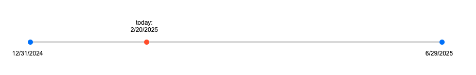

# timeline
This HTML file renders a simple timeline with three markers.


I have added it to the header in my canvas home pages, as well as
the syllabus, and each of the module overview pages.

To render the timeline, host this html file on a public web server
and include the following element in your canvas pages:

```
<iframe 
     src="https://your-server-path/timeline.html?start=2022-01-01&end=2022-12-31" 
     width="100%" height="200"></iframe>
```

Replace the `start` and `end` query parameters with the start and end dates
of your course. The timeline will show the current date as a red marker.

Optionally, I moved the styles to my css stylesheet and the script to my js file.
also, I use a different query string to link to a json file to get the start and 
end dates, so I can use the same timeline for multiple courses and terms.
