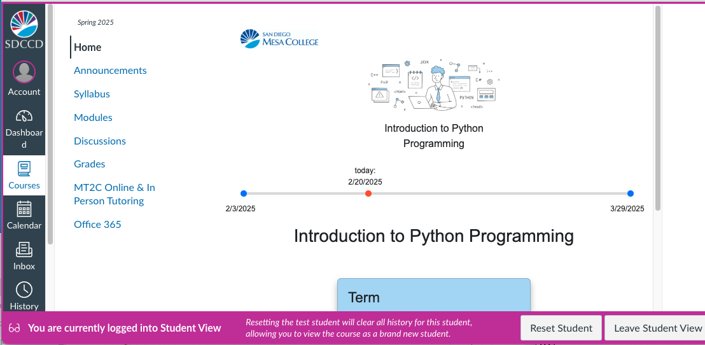

# timeline
This HTML file renders a simple timeline with three markers.

*Note: The sample image at the top of the screen is a screenshot, not linked to a live, dynamic page.*


I have added it to the header in my canvas home pages, as well as
the syllabus, and each of the module overview pages.

To render the timeline, host this html file on a public web server
and include the following element in your canvas pages:

```
<iframe 
     src="https://your-server-path/timeline.html?start=2022-01-01&end=2022-12-31" 
     width="100%" height="200"></iframe>
```

<div><hr>
<blockquote>
I was asked a question about this and specifically if it needed to be hosted in a separate server rather than embedded in a Canvas page. The issue is that Canvas does not allow Javascript directly, but they do allow embedding elements contained in iframe-s.
</blockquote>
<hr></div>

Replace the `start` and `end` query parameters with the start and end dates
of your course. The timeline will show the current date as a red marker.

Optionally, I moved the styles to my css stylesheet and the script to my js file.
also, I use a different query string to link to a json file to get the start and 
end dates, so I can use the same timeline for multiple courses and terms.


Here is what it looks like rendered in our Canvas pages:




### updated.. move from CDN to github pages:
```
timeline/
│
├── index.html        ← demo page (hosted on GitHub Pages)
├── README.md         ← usage instructions
│
├── js/
│   └── timeline.js   ← your widget code (ES module)
│
└── css/
    └── timeline.css  ← your widget styles
```


------------

# Timeline Widget

A lightweight, embeddable timeline widget for displaying progress between two dates.

Hosted on GitHub Pages:  
https://uid100.github.io/timeline/

---

## 📦 Installation

Include the CSS and JS from GitHub Pages:

```html
<link rel="stylesheet" href="https://uid100.github.io/timeline/css/timeline.css">
<script type="module" src="https://uid100.github.io/timeline/js/timeline.js"></script>
